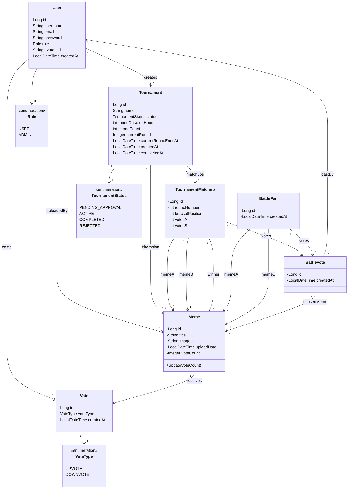
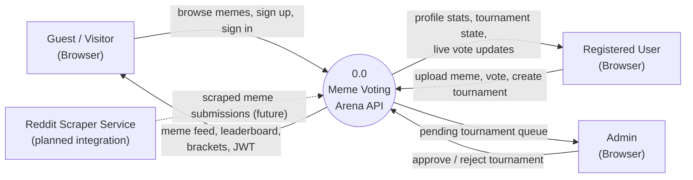
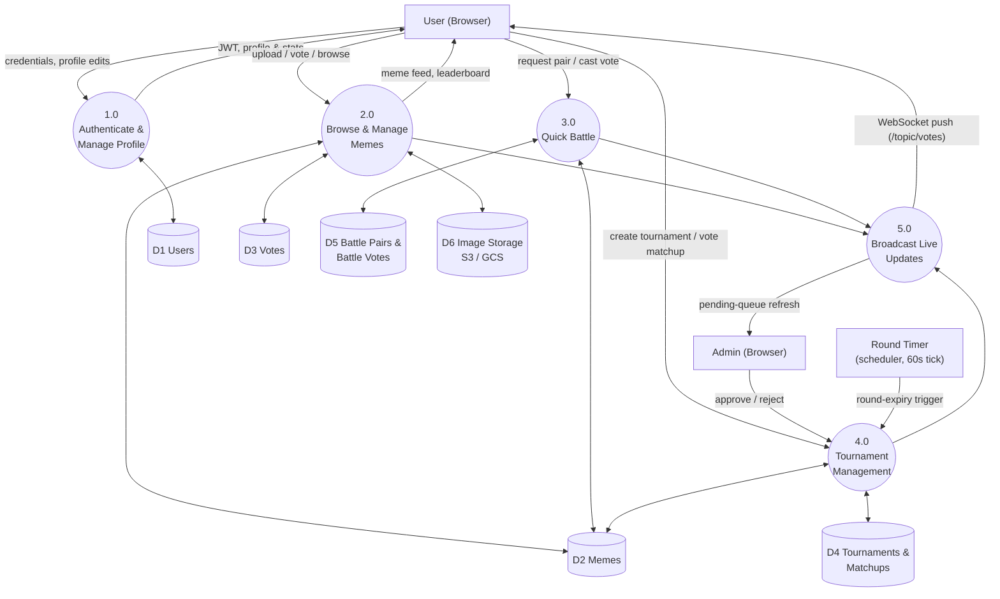
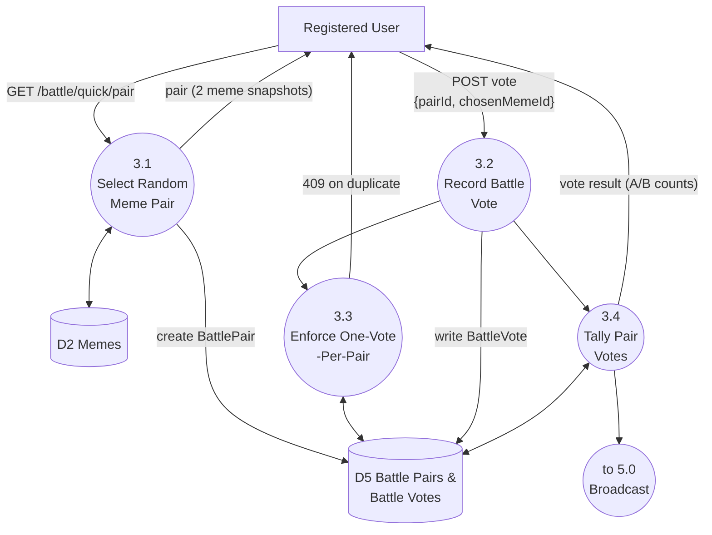
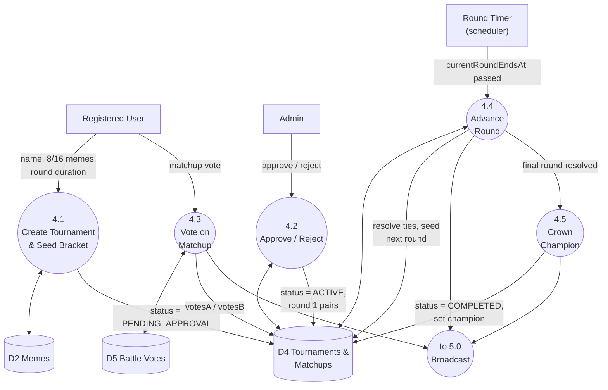
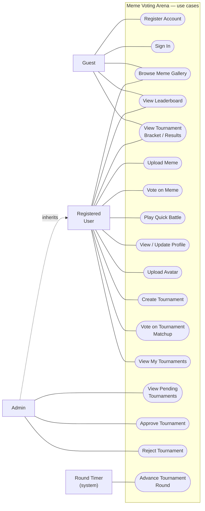

# gdg Backend — System Diagrams

Reverse-engineered from the current `gdg` codebase (Spring Boot 3.5, Java 21) — domain model, data flow at three levels of decomposition, and functional scope by actor. Drawn against the code as it stands after the test-hardening pass (176 passing tests), so entity fields, endpoints, and access rules below match what's actually implemented.

## Contents

1. [Class Diagram](#1-class-diagram)
2. [DFD — Level 0 (Context)](#2-dfd--level-0-context)
3. [DFD — Level 1 (Overview)](#3-dfd--level-1-overview)
4. [DFD — Level 2: Quick Battle (3.0)](#4-dfd--level-2-quick-battle-30)
5. [DFD — Level 2: Tournament Management (4.0)](#5-dfd--level-2-tournament-management-40)
6. [Use Case Diagram](#6-use-case-diagram)

---

## 1. Class Diagram

The seven JPA entities and their relationships. A `BattleVote` is deliberately polymorphic: exactly one of `battlePair` / `matchup` is set, distinguishing a Quick Battle vote from a tournament matchup vote — enforced at the database level by two separate unique constraints on `(user_id, battle_pair_id)` and `(user_id, matchup_id)`.

> **Not modeled as an entity:** `UserPrincipal` is a runtime Spring Security wrapper around `User`, not a persisted class — omitted here as an implementation detail of the security layer, not the domain.

---

## 2. DFD — Level 0 (Context)

The system as a single process, showing every actor that crosses its boundary. The Reddit scraper is drawn as a dotted flow — it's a planned integration (`redit-scraper`, a sibling project) with no wiring into this backend yet.

---

## 3. DFD — Level 1 (Overview)

The five major processes and six data stores behind the single Level 0 bubble. Every write path that touches vote counts (2.0, 3.0, 4.0) also triggers Process 5.0, which pushes the update to connected clients over the `/topic/votes` STOMP broker — the real-time layer behind the live vote counters in the UI.

---

## 4. DFD — Level 2: Quick Battle (3.0)

A pair is ephemeral — two random memes, no repeats enforced — and one vote per pair per user is guarded at the database layer, not just in application logic.

---

## 5. DFD — Level 2: Tournament Management (4.0)

The only automated actor in the system: a scheduler ticks every 60 seconds, checks for tournaments whose round has expired, and advances them — resolving ties, seeding the next round, or crowning a champion on the final round.

---

## 6. Use Case Diagram

Four actors: an unauthenticated **Guest**, a **Registered User**, an **Admin** (every Registered User capability, plus tournament moderation — `ADMIN` is a `User.role` value, not a separate account type), and the **Round Timer**, the system's one non-human actor. Boundaries here match `SecurityConfig`'s production filter chain exactly — e.g. matchup voting requires authentication, but viewing a bracket does not.

> **Read vs. write split:** Guest already covers every public GET — gallery, leaderboard, and tournament brackets are open by design (`SecurityConfig` permits them unauthenticated) so results stay shareable without an account.

---

*Diagrams generated from the codebase as of the current test-hardening pass. Source: `gdg/src/main/java/com/meme/gdg`.*
